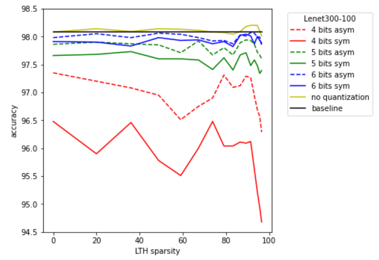
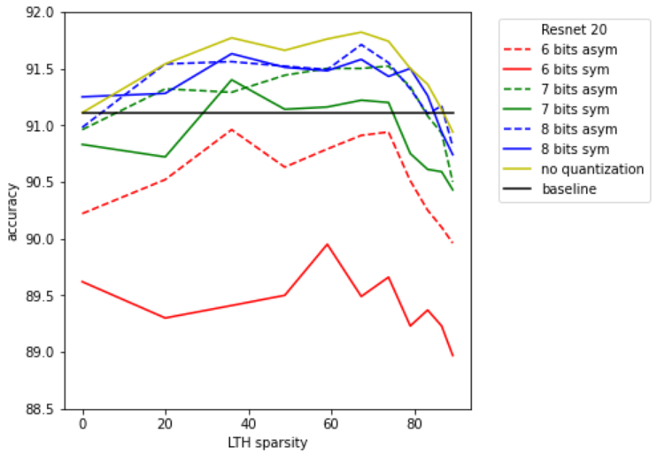

# Quantizing Lottery Tickets
This is the code for QLTH, a 2-step model compression scheme that applies Post-Training Quantization on the subnetworks derived by iterative magnitude prunning used in finding ”winning tickets” or ”matching”.

## LTH Experiments

All LTH experiments are conducted using the [OpenLTH](https://github.com/facebookresearch/open_lth) framework, which is located in the folder `open_lth`.

First do `cd open_lth`, then:

the Lottery Ticket without Rewinding experiment results could be reproduced with the following commands:
```bash
python open_lth.py lottery --model_name cifar_resnet_20 --default_hparams=cifar_resnet_20 --levels=10
python open_lth.py lottery --model_name cifar_resnet_56 --default_hparams=cifar_resnet_20 --levels=10
python open_lth.py lottery --model_name mnist_lenet_300_100 --default_hparams=mnist_lenet_300_100 --levels=15
```

and the Lottery Ticket with Rewinding experiment results could be reproduced with the following commands:
```bash
python open_lth.py lottery --model_name cifar_resnet_20 --default_hparams=cifar_resnet_20 --levels=10 --rewinding_steps=2000it
python open_lth.py lottery --model_name cifar_resnet_56 --default_hparams=cifar_resnet_20 --levels=10 --rewinding_steps=2000it
```

## Quantization Experiments
After deriving the checkpoints for LTH experiments, the quantization experiments could be performed using the [Neural Network Distiller](https://github.com/IntelLabs/distiller) library. The experiment scripts are located in the folder `examples/classifier_compression`.

First do `cd examples/classifier_compression`, then adjust the following command to run experiments for different settings:
```bash
python compress_classifier.py -a [MODEL_ARCH] [DATASET_PATH] \
                --resume [LOTTERY_MODEL_CHECKPOINT_PATH] \
                --evaluate --lth --pruned -mp [LOTTERY_MASK_PATH] \
                --qe --qebw [QE_NUM_BITS_WTS] --qeba [QE_NUM_BITS_ACTS] --qem [QE_MODE]
```

For example, the following command will run a quantization experiment on a trained ResNet 20 model with 90% of parameters pruned, using 8 bits for weights and activation quantization, and asymmetric quanzation mode:
```bash
python compress_classifier.py -a resnet20_cifar ../../../data.cifar10 \
                --resume ~/open_lth_data/lottery_6a3f90a482a5e73fa0473f151fe64163/replicate_1/level_10/main/model_best.pth \
                --evaluate --lth --pruned -mp ~/open_lth_data/lottery_6a3f90a482a5e73fa0473f151fe64163/replicate_1/level_10/main/mask.pth \
                --qe --qebw 8 --qeba 8 --qem asym_u
```
## Some Results
This section includes parts of the results provided in the report.

**LeNet 300-100 on MNIST dataset using our IMP-quantization pipeline**



**ResNet 20 on CIFAR10 dataset using our IMP-quantization pipeline (with rewinding in IMP)**



**ResNet 56 on CIFAR10 dataset using our IMP-quantization pipeline (with rewinding in IMP)**


